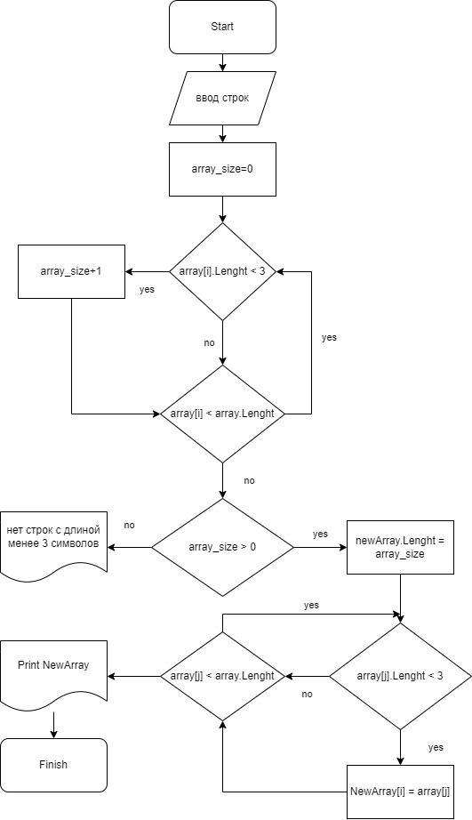

#  Задача.
Написать программу, которая из имеющегося массива строк формирует новый массив из строк, длина которых меньше, либо равна 3 символам. Первоначальный массив можно ввести с клавиатуры, либо задать на старте выполнения алгоритма. При решении не рекомендуется пользоваться коллекциями, лучше обойтись исключительно массивами.

# Блок-схема алгоритма.

# Описание алгоритма решения задачи.
**1.** Просим пользователя ввести количество строк.

**2.** Пользователь вводит количество строк и строки.

**3**. Определяем количество строк, содержащих не более 3 символов.

**4**. Если строк содержащих менее 3 символов нет, программа выдаёт соответсвующий ответ.

**5**. Усли строки содержащие менее 3 символов найдены, записываем их в новый массив.

**6**. Выводим итоговый массив на печать.